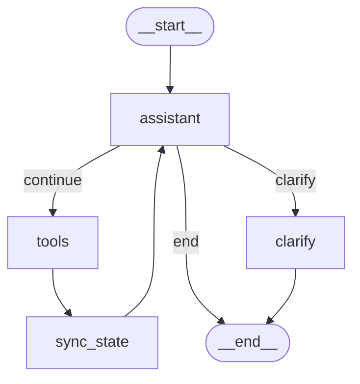

# AI менеджер задач

Лёгкий проект, в котором один ассистент принимает сообщение пользователя и решает, что делать дальше:

* ответить сразу;
* запросить уточнение;
* перейти к инструментам;
* сохранить или прочитать данные из базы;
* вернуть итоговый ответ после синхронизации состояния.

---

## Идея проекта

Этот проект - **диспетчер задач и напоминаний**.

Ассистент получает текст пользователя и определяет, какой это тип запроса:

* обычный вопрос;
* создание задачи;
* создание напоминания;
* просмотр списка задач;
* обновление статуса задачи;

После этого граф выбирает нужную ветку, выполняет действие и возвращает результат пользователю.

---

## Архитектура графа

В центре системы находится узел **assistant**.

Он получает запрос пользователя и принимает одно из решений:

1. **Ответить сразу**, если запрос простой.
2. **Попросить уточнение**, если не хватает данных.
3. **Передать запрос в tools**, если нужно действие: сохранить задачу, создать напоминание, обновить запись в базе, прочитать файл.

После выполнения инструмента управление переходит в узел **sync_state**, где состояние обновляется, а затем снова возвращается в **assistant** - уже для финального ответа.

### Основные узлы

* `assistant` - главный узел принятия решения;
* `clarify` - ветка уточнения;
* `tools` - выполнение действий;
* `sync_state` - синхронизация состояния после tools.

### Основные переходы

* `START -> assistant`
* `assistant -> tools`
* `assistant -> clarify`
* `assistant -> END`
* `tools -> sync_state`
* `sync_state -> assistant`

### Mermaid-схема



---

## Что умеет проект

### Обычные вопросы

Пример:

```text
Что такое LangGraph?
```

Ассистент отвечает текстом без обращения к БД.

### Создание задачи

Пример:

```text
Создай задачу: подготовить отчет до пятницы, приоритет высокий
```

Система выделяет текст задачи и сохраняет запись в PostgreSQL.

### Создание напоминания

Пример:

```text
Напомни завтра в 8 утра позвонить маме
```

Система создаёт запись в таблице напоминаний.

### Просмотр задач

Пример:

```text
Покажи задачи
```

Система читает записи из базы и выводит их пользователю.

### Обновление статуса задачи

Пример:

```text
Отметь задачу 1 как выполненную
```

Система обновляет статус задачи в БД.

### Чтение файла

Пример:

```text
/file uploads/sample_note.txt
```

Программа читает файл и передаёт его содержимое в обработку.

### Рендер диаграммы

Команда:

```text
/render
```

Создаёт Mermaid-файл и PNG-схему графа.

---

## Стек технологий

### Основной стек

* **Python 3.10+**
* **LangGraph** - граф состояний
* **LangChain** - интеграция с LLM
* **Ollama** - локальные модели
* **PostgreSQL** - хранение задач и напоминаний
* **Docker Compose** - запуск сервисов
* **Mermaid** - визуализация графа

### Локальные модели

Проект можно запускать, например, на таких моделях:

* `llama3.2:3b` - для обычных ответов;
* `qwen3:4b` - для более умного assistant/router.

---

## Структура проекта

```text
onefile_task_dispatcher/
├── main.py
├── requirements.txt
├── docker-compose.yml
├── .env.example
├── .gitignore
├── uploads/
├── logs/
└── diagrams/

---

## База данных

Проект использует PostgreSQL.

Обычно в проекте есть две основные таблицы:

### `tasks`

Хранит задачи:

* `id`
* `title`
* `description`
* `priority`
* `status`
* `created_at`

### `reminders`

Хранит напоминания:

* `id`
* `reminder_text`
* `remind_at`
* `status`
* `created_at`

---

## Установка и запуск

### 1. Клонирование проекта

```bash
git clone <your-repo-url>
cd onefile_task_dispatcher
```

### 2. Создание виртуального окружения

#### Windows PowerShell

```powershell
python -m venv .venv
.\.venv\Scripts\activate
pip install -r requirements.txt
```

#### Linux / WSL2

```bash
python3 -m venv .venv
source .venv/bin/activate
pip install -r requirements.txt
```

### 3. Создание `.env`

```powershell
Copy-Item .env.example .env
```

Если файл уже есть, просто отредактируй его.

### 4. Запуск PostgreSQL и Ollama

```powershell
docker compose up -d
```

### 5. Загрузка моделей в Ollama

Если контейнер Ollama называется `onefile_ollama`:

```powershell
docker exec -it onefile_ollama ollama pull llama3.2:3b
docker exec -it onefile_ollama ollama pull qwen2.5:1.5b
```

Если имя контейнера другое, посмотри его через:

```powershell
docker ps
```

### 6. Проверка, что Ollama отвечает

```powershell
curl http://localhost:11434/api/tags
```

### 7. Запуск приложения

```powershell
python main.py
```

---

## Примеры запросов

Попробуй такие команды:

```text
Привет
Что такое LangGraph?
Создай задачу: подготовить отчет до пятницы, приоритет высокий
Напомни завтра в 8 утра позвонить маме
Покажи задачи
Отметь задачу 1 как выполненную
/file uploads/sample_note.txt
/render
exit
```

---

## Пример сценария работы

### Сценарий: создание задачи

Пользователь пишет:

```text
Создай задачу: подготовить отчет до пятницы, приоритет высокий
```

Граф проходит примерно такой путь:

1. `assistant` принимает сообщение.
2. Определяет, что нужен инструмент сохранения задачи.
3. Переходит в `tools`.
4. `tools` записывает задачу в PostgreSQL.
5. `sync_state` обновляет состояние.
6. Управление возвращается в `assistant`.
7. `assistant` формирует итоговый ответ пользователю.

Результат:

```text
Задача успешно создана и сохранена в базе.
```
---

## Ограничения текущего MVP

* часть логики может быть упрощена;
* router может быть сделан на Python вместо сложного LLM-routing;
* извлечение структуры из текста может быть базовым;
* дата и время для напоминаний могут обрабатываться не идеально;
* не все ошибки пользователя пока обязательно обрабатываются красиво.
